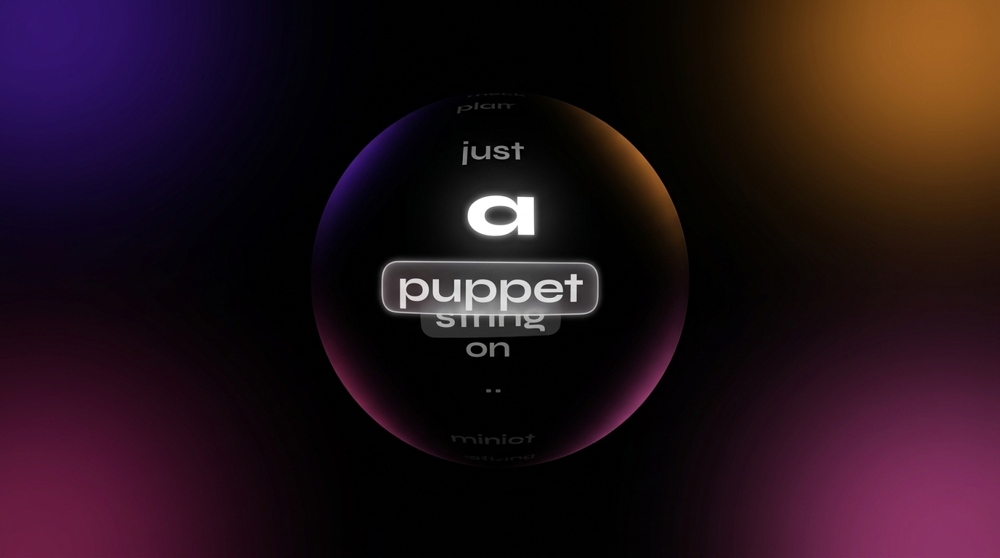
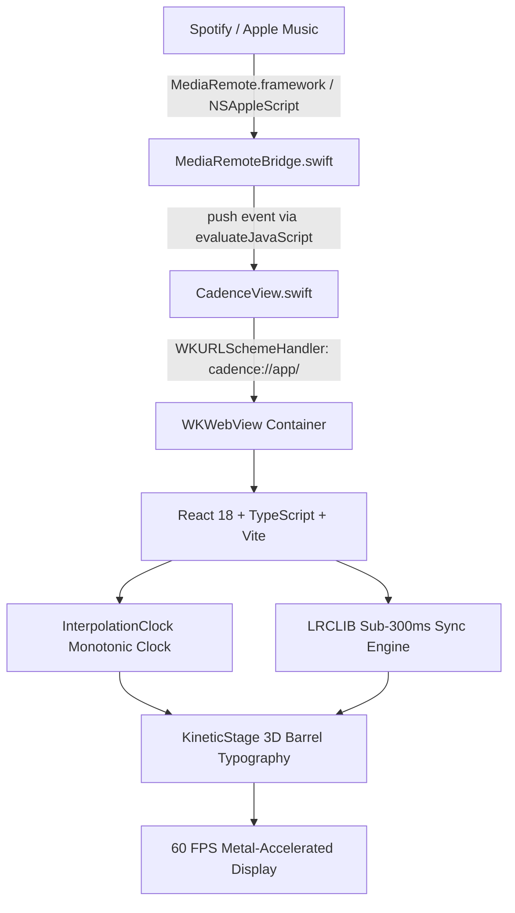

<div align="center">

# ⚡ CADENCE
### *Cinematic Kinetic Typography Screen Saver for macOS*

[](https://apple.com)
[](https://github.com/sachinkumar-gg/cadence)
[](https://spotify.com)
[](https://music.apple.com)
[](LICENSE)

<br />



<br />
<br />

**Cadence** is a native macOS screensaver (`.saver`) that transforms your Mac's display into a breathtaking typographic experience. As music plays on **Spotify** or **Apple Music**, song lyrics fly through 3D curved space with barrel fisheye distortion, responsive ambient color blooms, and zero-jitter syllable synchronization.

</div>

---

## ✨ Features

- **🌀 3D Barrel & Cylindrical Fisheye Lens**  
  Words warp dynamically along a virtual 3D cylinder. The active sung word surges forward with brilliant luminosity, subtle tilt physics, and 3D depth blur.

- **⏱ Zero-Jitter Monotonic Interpolation Clock**  
  Eliminates polling stutter completely. Renders continuous 60fps animations with monotonic `performance.now()` elapsed interpolation, coupled with automatic drift-snap thresholds (<150ms) to track seeks and track transitions instantly.

- **⚡ Instant Sub-300ms Lyric Sync**  
  Integrated with LRCLIB for real-time word-by-word and line-by-line synchronized lyrics. Fast primary lookup queries resolve in under 300ms, with duration-ranked candidate selection to guarantee you never get a mismatched live or radio cut.

- **🎨 Ambient OLED Corner Blooms**  
  Pure OLED black backdrop (`#050507`) accented by silky-smooth, multi-quadrant ambient blooms dynamically extracted from active album artwork.

- **🎵 Instrumental Interlude & Intro Visualizer**  
  Never freezes during guitar solos or long intros. When vocal breaks occur, Cadence seamlessly transitions to an animated audio wave equalizer with a subtle preview of the upcoming line.

- **🛡 Sandbox-Safe Native macOS Architecture**  
  Built with Swift and custom `WKURLSchemeHandler` (`cadence://app/`), completely bypassing `file://` sandboxing restrictions and WebKit process termination bugs in `ScreenSaverEngine`.

---

## 🚀 Quick Start & Installation

### Option 1: Build & Install Automatically (Recommended)

Clone the repository and run the automated build script:

```bash
git clone https://github.com/sachinkumar-gg/cadence.git
cd cadence
npm install
./macos/build-saver.sh
```

The script will:
1. Compile the web application into high-performance static assets.
2. Build the native Swift `.saver` bundle with Apple's `swiftc` compiler.
3. Package assets into `Contents/Resources/dist`.
4. Codesign with an ad-hoc certificate.
5. Automatically copy `Cadence.saver` to `~/Library/Screen Savers/`.

---

## 🖥 Enabling in macOS

1. Open **System Settings** (or **System Preferences**).
2. Navigate to **Screen Saver**.
3. Scroll to the **Other** section and select **Cadence**.
4. Click **Preview** or trigger screen saver timeout to enjoy!

> **Tip:** You can test instant activation directly from your terminal:
> ```bash
> defaults -currentHost write com.apple.screensaver idleTime 5
> ```
> *(Triggers screen saver after 5 seconds of idle mouse/keyboard)*

---

## ⌨️ Controls & Shortcuts (Preview / Simulator Mode)

When previewing or running in local dev mode, Cadence supports interactive keybindings:

| Key | Action |
| :--- | :--- |
| <kbd>Space</kbd> | Play / Pause |
| <kbd>[</kbd> | Nudge timing offset **-50ms** |
| <kbd>]</kbd> | Nudge timing offset **+50ms** |
| <kbd>F</kbd> | Toggle Fullscreen |

---

## 🏗 Architecture

Cadence marries a lightweight native macOS Screen Saver wrapper with modern reactive 3D kinetic typography:



### Key Components

- **`macos/CadenceScreenSaver/`**:
  - `CadenceView.swift`: Subclasses `ScreenSaverView`, establishes WebKit configuration with DOM timer process suppression disabled.
  - `MediaRemoteBridge.swift`: Connects to macOS's private `MediaRemote.framework` for zero-latency Now Playing playback rate and timestamp updates.
- **`src/services/`**:
  - `clock.ts`: High-precision monotonic interpolation clock.
  - `lrclib.ts`: Fast sub-300ms synced lyric retrieval with duration ranking.
  - `lrcParser.ts`: Syllable-weighted vocal cadence estimator and instrumental detector.
- **`src/components/`**:
  - `KineticStage.tsx`: 3D viewport with perspective distortion.
  - `KineticWordBlock.tsx`: Word-level physics, tilt angles, pill badges, and length-aware scaling.
  - `AmbientCorners.tsx`: 4-corner animated color mesh blooms.

---

## 🛠 Local Web Development

To run Cadence inside your browser:

```bash
npm install
npm run dev
```

Visit `http://localhost:5173` to test the kinetic stage with built-in simulator tracks.

---

## 📄 License

Distributed under the **MIT License**. See `LICENSE` for more information.
